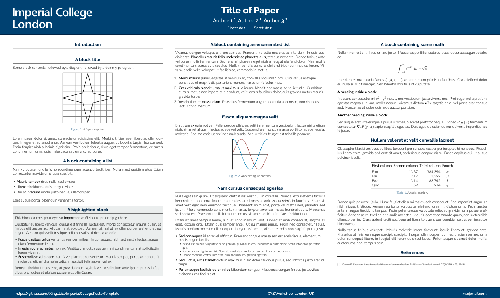

# An Unofficial LaTex Template for Mathematics/Statistics Posters at Imperial College

Credit: Edited based on [gimini](https://github.com/anishathalye/gemini) and a [variation](https://rev.cs.uchicago.edu/k4rtik/gemini-uccs) for University of Chicago.

The Imperial College crest is not included due to the [updated branding rule](https://www.imperial.ac.uk/brand-style-guide/visual-identity/the-college-crest/) as of 2020.

This template is **unofficial**.
